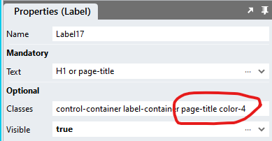
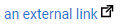
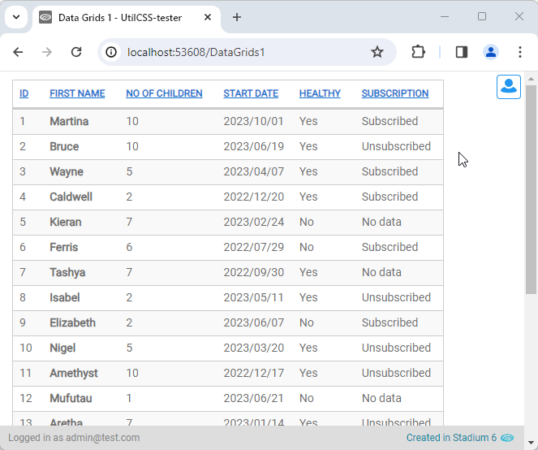
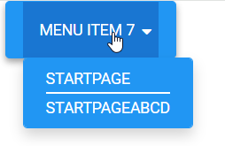
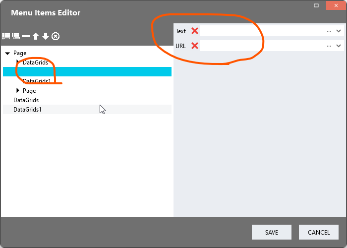

# CSS Utilities

This module contains a set of CSS classes that can be added to the classes property of controls in applications to quickly apply a number of frequently-used styles. 

## Version
1.0 initial release

1.1 Added some display options; added empty table header CSS

## Table of Contents
- [CSS Utilities](#css-utilities)
  - [Version](#version)
  - [Table of Contents](#table-of-contents)
- [Setup](#setup)
  - [Application setup](#application-setup)
  - [Apply the module](#apply-the-module)
  - [Upgrading the module](#upgrading-the-module)
  - [Implement a utility class](#implement-a-utility-class)
  - [Customise the class display](#customise-the-class-display)
- [Supported classes](#supported-classes)
  - [Typography](#typography)
    - [Titles \& headings](#titles--headings)
    - [Large \& small text](#large--small-text)
    - [Font size 0px](#font-size-0px)
    - [Font sizes from 9px to 50px](#font-sizes-from-9px-to-50px)
    - [Text styles](#text-styles)
    - [Text casing](#text-casing)
    - [Word spacing](#word-spacing)
    - [Letter spacing](#letter-spacing)
    - [Line height](#line-height)
    - [Text alignment](#text-alignment)
    - [Break words](#break-words)
    - [Preformatted text](#preformatted-text)
  - [Colours](#colours)
    - [Text colour](#text-colour)
    - [Background colour](#background-colour)
    - [Border colour](#border-colour)
    - [Remove text colour](#remove-text-colour)
    - [Remove background colour](#remove-background-colour)
    - [Remove border colour](#remove-border-colour)
  - [Buttons](#buttons)
    - [Primary](#primary)
    - [Secondary](#secondary)
    - [Tertiary](#tertiary)
  - [Divider](#divider)
  - [User Interactions \& Cursors](#user-interactions--cursors)
    - [Prevent text selection](#prevent-text-selection)
    - [Prevent clicking](#prevent-clicking)
    - [Cursors](#cursors)
  - [Display \& Layout](#display--layout)
    - [Relative positioning](#relative-positioning)
    - [Absolute positioning](#absolute-positioning)
    - [Fixed positioning](#fixed-positioning)
    - [Top](#top)
    - [Right](#right)
    - [Bottom](#bottom)
    - [Left](#left)
    - [Z-Index](#z-index)
    - [Opacity](#opacity)
    - [Display block](#display-block)
    - [Display inline-block](#display-inline-block)
    - [Display inline](#display-inline)
    - [Display grid](#display-grid)
    - [Display flex](#display-flex)
    - [Don't display (hide)](#dont-display-hide)
    - [Absolute center alignment](#absolute-center-alignment)
    - [Vertical center alignment](#vertical-center-alignment)
    - [Vertical top alignment](#vertical-top-alignment)
    - [Vertical bottom alignment](#vertical-bottom-alignment)
    - [Horizontal center alignment](#horizontal-center-alignment)
    - [Horizontal left alignment](#horizontal-left-alignment)
    - [Horizontal right alignment](#horizontal-right-alignment)
    - [Gap](#gap)
  - [Heights and widths](#heights-and-widths)
    - [Height](#height)
    - [Width](#width)
    - [Height as percentage of parent](#height-as-percentage-of-parent)
    - [Width as percentage of parent](#width-as-percentage-of-parent)
    - [Height as percentage of viewport](#height-as-percentage-of-viewport)
    - [Width as percentage of viewport](#width-as-percentage-of-viewport)
    - [Third and quarter heights as percentage of parent](#third-and-quarter-heights-as-percentage-of-parent)
    - [Third and quarter widths as percentage of parent](#third-and-quarter-widths-as-percentage-of-parent)
    - [Maximum height](#maximum-height)
    - [Maximum width](#maximum-width)
    - [Maximum height as percentage of parent](#maximum-height-as-percentage-of-parent)
    - [Maximum width as percentage of parent](#maximum-width-as-percentage-of-parent)
    - [Maximum height as percentage of viewport](#maximum-height-as-percentage-of-viewport)
    - [Maximum width as percentage of viewport](#maximum-width-as-percentage-of-viewport)
    - [Third and quarter maximum heights as percentage of parent](#third-and-quarter-maximum-heights-as-percentage-of-parent)
    - [Third and quarter maximum widths as percentage of parent](#third-and-quarter-maximum-widths-as-percentage-of-parent)
  - [Overflow](#overflow)
    - [Overflow hidden](#overflow-hidden)
    - [Overflow auto](#overflow-auto)
    - [Overflow scroll](#overflow-scroll)
  - [Padding](#padding)
    - [Paddings all sides](#paddings-all-sides)
    - [Top padding](#top-padding)
    - [Right padding](#right-padding)
    - [Bottom padding](#bottom-padding)
    - [Left padding](#left-padding)
  - [Margin](#margin)
    - [Margins all sides](#margins-all-sides)
    - [Top margin](#top-margin)
    - [Right margin](#right-margin)
    - [Bottom margin](#bottom-margin)
    - [Left margin](#left-margin)
  - [Lists](#lists)
    - [Unordered list](#unordered-list)
    - [Unordered list tem](#unordered-list-tem)
    - [Unordered list style type](#unordered-list-style-type)
    - [Ordered list](#ordered-list)
  - [Box Shadows](#box-shadows)
    - [Predefined box shadows](#predefined-box-shadows)
    - [Bottom box shadow only](#bottom-box-shadow-only)
    - [Remove all box shadow](#remove-all-box-shadow)
  - [Borders](#borders)
    - [Border on all sides](#border-on-all-sides)
    - [Border width](#border-width)
    - [Top border](#top-border)
    - [Top border width](#top-border-width)
    - [Right border](#right-border)
    - [Right border width](#right-border-width)
    - [Bottom border](#bottom-border)
    - [Bottom border width](#bottom-border-width)
    - [Left border](#left-border)
    - [Left border width](#left-border-width)
    - [Transparent border](#transparent-border)
    - [Border styles](#border-styles)
    - [Border radius](#border-radius)
  - [Link styles](#link-styles)
    - [External links](#external-links)
  - [DataGrid Display](#datagrid-display)
    - [Broad display](#broad-display)
    - [Tight display](#tight-display)
    - [Light display](#light-display)
    - [Heavy display](#heavy-display)
    - [Row-level hover background](#row-level-hover-background)
    - [Fix headers](#fix-headers)
  - [Menu styles](#menu-styles)
    - [Show submenu dividers](#show-submenu-dividers)

# Setup

## Application setup
1. Check the Enable Style Sheet checkbox in the application properties

## Apply the module
1. Create a folder called "CSS" inside of your Embedded Files in your application
2. Drag the two CSS files from this repo [*utils-variables.css*](utils-variables.css) and [*utils.css*](utils.css) into that folder
3. Paste the link tags below into the *head* property of your application
```html
<link rel="stylesheet" href="{EmbeddedFiles}/CSS/utils.css">
<link rel="stylesheet" href="{EmbeddedFiles}/CSS/utils-variables.css">
``` 

## Upgrading the module
To upgrade the CSS in this module, follow the [steps outlined in this repo](https://github.com/stadium-software/samples-upgrading)

## Implement a utility class
1. First, make sure you have [applied the module](#apply-the-module)
2. Find a class you want to add in the list below
3. Add the class to the classes property of a control in lower case



## Customise the class display
1. Open the CSS file called [*utils-variables.css*](utils-variables.css) from this repo
2. Adjust the variables in the *:root* element as you see fit
3. Overwrite the file in the CSS folder of your application with the customised file

[Back to top](#table-of-contents)

# Supported classes

## Typography

### Titles & headings
Titles and head classes affect various aspects of text display

**Class name**
```css
h1
```
**h1 customisations**
```css
--utils-h1-font-size: 32px;
--utils-h1-font-weight: 600;
--utils-h1-line-height: 1.5;
--utils-h1-margin-top: 1em;
--utils-h1-margin-bottom: .5em;
```

**Class name**
```css
h2
```
**h2 customisations**
```css
--utils-h2-font-size: 24px;
--utils-h2-font-weight: 600;
--utils-h2-line-height: 1.5;
--utils-h2-margin-top: 1em;
--utils-h2-margin-bottom: .5em;
```

**Class name**
```css
h3
```
**h3 customisations**
```css
--utils-h3-font-size: 18px;
--utils-h3-font-weight: 600;
--utils-h3-line-height: 1.5;
--utils-h3-margin-top: 1em;
--utils-h3-margin-bottom: .5em;
```

**Class name**
```css
page-title
```
**page-title customisations**
```css
--utils-page-title-font-size: 22px;
--utils-page-title-font-weight: 600;
--utils-page-title-line-height: 1.5;
--utils-page-title-margin-top: 1em;
--utils-page-title-margin-bottom: .5em;
```

**Class name**
```css
subtitle
```
**subtitle customisations**
```css
--utils-subtitle-font-size: 18px;
--utils-subtitle-font-weight: 600;
--utils-subtitle-line-height: 1.5;
--utils-subtitle-margin-top: 1em;
--utils-subtitle-margin-bottom: .5em;
```

[Back to top](#table-of-contents)

### Large & small text
Large & small text classes affect the size of displayed text 

**Class name**
```css
large-text
```
**Class name**
```css
small-text
```

[Back to top](#table-of-contents)

### Font size 0px

**Class name**
```css
font-size-0
```

[Back to top](#table-of-contents)

### Font sizes from 9px to 50px

1. Append a number between 9 and 50 to the base class name
2. Increments by 1 (9, 10, 11, etc.)
3. The number will become a pixel value

**Example for a 20px font size**
```css
font-size-20
```

[Back to top](#table-of-contents)

### Text styles
Text style classes affect the style of displayed text 

**Class name**
```css
italic
```
**Class name**
```css
bold
```
**Class name**
```css
underline
```

[Back to top](#table-of-contents)

### Text casing
Text cas classes allow for changing the case of displayed text 

**Class name**
```css
lower-case
```
**Class name**
```css
upper-case
```
**Class name**
```css
captitalize
```

[Back to top](#table-of-contents)

### Word spacing
Word spacing classes allow for increasing or decreasing the spaces between words

1. Append a number between -3 and 10 to the base class name
2. Increments by 1 (-1, 0, 1, etc.)
3. The number will become a pixel value

**Example class for 'word-spacing: 3px;'**
```css
word-spacing-3
```
**Example class for 'word-spacing: -1px;'**
```css
word-spacing--1
```

[Back to top](#table-of-contents)

### Letter spacing
Letter spacing classes allow for increasing or decreasing the spaces between letters
1. Append a pixel value to the base class name between -3 and 3
2. Increment by 1 (-1, 0, 1, etc.)

**Example class for 'letter-spacing: 4px;'**
```css
letter-spacing-4
```
**Example class for 'letter-spacing: -1px;'**
```css
letter-spacing--1
```

[Back to top](#table-of-contents)

### Line height
Line height classes allow for increasing or decreasing the line-height attribute of displayed text
1. Calculated as percentage of font-size
2. Append a value to the base class name between 50 and 250 (the equivalent of a line-height of 0.5 to 2.5)
3. Increments by 10 (50, 60, 70, etc.)

**Example class for 'line-height: 140%;' (the equivalent of 'line-height:1.4;')**
```css
line-height-140
```

[Back to top](#table-of-contents)

### Text alignment
Various ways of align text

**Class name**
```css
text-justify
```

**Class name**
```css
text-left
```

**Class name**
```css
text-right
```

**Class name**
```css
text-center
```

[Back to top](#table-of-contents)

### Break words
This class prevents word overflow by hyphenat long words

Only works with width-restricted elements

**Class name**
```css
break-word
```

[Back to top](#table-of-contents)

### Preformatted text
Provides for the display of preformatted text, such as code. In preformatted text line breaks are preserved. 

**Class name**
```css
preformatted
```
**Preformatted text customisations**
```css
--utils-preformatted-font-family: monospace;
--utils-preformatted-background-color: #ddd;
--utils-preformatted-font-color: #333;
--utils-preformatted-font-size: 14px;
--utils-preformatted-max-width: 100%;
--utils-preformatted-min-width: 100px;
--utils-preformatted-padding: .3em;
--utils-preformatted-line-height: 1.2;
--utils-preformatted-letter-spacing: -0.05em;
```

[Back to top](#table-of-contents)

## Colours

Customisable and reusable colours for text, backgrounds and borders. Text and background colours can be applied to labels, links buttons, form inputs and drop-downs. 

Customise the colour palette by locating and changing the values shown below in the [*utils-variables.css*](utils-variables.css) file

**Colour customisations**
```css
--utils-color-1: #333;
--utils-color-2: #777777;
--utils-color-3: #f9f9f9;
--utils-color-4: #2196F3;
--utils-color-5: #1976D2;
--utils-color-6: #aaa;
--utils-color-7: #fff;
--utils-color-8: #00889e;
--utils-color-9: #ddd;
--utils-color-10: #333;
--utils-color-11: #333;
--utils-color-12: #777777;
--utils-color-13: #f9f9f9;
--utils-color-14: #2196F3;
--utils-color-15: #1976D2;
--utils-color-16: #aaa;
--utils-color-17: #fff;
--utils-color-18: #00889e;
--utils-color-19: #ddd;
--utils-color-20: #333;
--utils-color-21: #333;
--utils-color-22: #777777;
--utils-color-23: #f9f9f9;
--utils-color-24: #2196F3;
--utils-color-25: #1976D2;
--utils-color-26: #aaa;
--utils-color-27: #fff;
--utils-color-28: #00889e;
--utils-color-29: #ddd;
```

### Text colour
1. Select a colour from the variables list above
2. Append the number to the classname

**Example for colour 4 (#2196F3)**
```css
color-4
```

[Back to top](#table-of-contents)

### Background colour
1. Select a colour from the variables list above
2. Append the number to the classname

**Example for background colour 4 (#2196F3)**
```css
background-color-4
```

[Back to top](#table-of-contents)

### Border colour
1. Select a colour from the variables list above
2. Append the number to the classname

**Example for border colour 4 (#2196F3)**
```css
border-color-4
```

[Back to top](#table-of-contents)

### Remove text colour
Sets element colour to transparent

**Class name**
```css
color-none
```

[Back to top](#table-of-contents)

### Remove background colour
Sets element background colour to transparent

**Class name**
```css
background-color-none
```

[Back to top](#table-of-contents)

### Remove border colour
Sets the border colour to transparent

**Class name**
```css
border-color-none
```

[Back to top](#table-of-contents)

## Buttons
Provides for three button types, primary, secondary and tertiary. 

Add 'disabled' to the classes list invokes the disabled button style for that type and prevents users from interact with the button. 

### Primary
Primary buttons 

**Class name**
```css
primary
```

**Primary button customisations**
```css
--utils-primary-button-background-color: #3399ff;
--utils-primary-button-border-color: #2196f3;
--utils-primary-button-border-width: 1px;
--utils-primary-button-border-radius: 3px;
--utils-primary-button-font-color: white;
--utils-primary-button-font-size: 14px;
--utils-primary-button-text-transform: uppercase;
--utils-primary-button-text-decoration: none;
--utils-primary-button-padding: 10px 16px;
--utils-primary-button-box-shadow: 0 3px 6px rgba(0, 0, 0, 0.16), 0 3px 6px rgba(0, 0, 0, 0.23);
--utils-primary-button-outline-color: white;
--utils-primary-button-outline-width: 1px;

--utils-primary-hover-button-background-color: #1976d2;
--utils-primary-hover-button-border-color: #2196f3;
--utils-primary-hover-button-border-width: 1px;
--utils-primary-hover-button-border-radius: 3px;
--utils-primary-hover-button-font-color: #fff;
--utils-primary-hover-button-font-size: 14px;
--utils-primary-hover-button-text-transform: uppercase;
--utils-primary-hover-button-text-decoration: none;
--utils-primary-hover-button-padding: 10px 16px;
--utils-primary-hover-button-box-shadow: 0 10px 20px rgba(0, 0, 0, 0.19), 0 6px 6px rgba(0, 0, 0, 0.23);
```

**Class names**
```css
primary disabled
```
**Disabled primary button customisations**
```css
--utils-primary-disabled-button-background-color: #1976d2;
--utils-primary-disabled-button-border-color: #2196f3;
--utils-primary-disabled-button-border-width: 1px;
--utils-primary-disabled-button-border-radius: 3px;
--utils-primary-disabled-button-font-color: #fff;
--utils-primary-disabled-button-font-size: 14px;
--utils-primary-disabled-button-text-transform: uppercase;
--utils-primary-disabled-button-text-decoration: none;
--utils-primary-disabled-button-padding: 10px 16px;
--utils-primary-disabled-button-box-shadow: none;
--utils-primary-disabled-button-opacity: 0.6;
```

[Back to top](#table-of-contents)

### Secondary
Secondary buttons 

**Class name**
```css
secondary
```
**Secondary button customisations**
```css
--utils-secondary-button-background-color: rgb(255, 255, 255);
--utils-secondary-button-border-color: #2196f3;
--utils-secondary-button-border-width: 1px;
--utils-secondary-button-border-radius: 3px;
--utils-secondary-button-font-color: #3399ff;
--utils-secondary-button-font-size: 14px;
--utils-secondary-button-text-transform: uppercase;
--utils-secondary-button-text-decoration: none;
--utils-secondary-button-padding: 10px 16px;
--utils-secondary-button-box-shadow: 0 3px 6px rgba(0, 0, 0, 0.16), 0 3px 6px rgba(0, 0, 0, 0.23);
--utils-secondary-button-outline-color: white;
--utils-secondary-button-outline-width: 1px;

--utils-secondary-hover-button-background-color: rgba(255,255,255,.8);
--utils-secondary-hover-button-border-color: #2196f3;
--utils-secondary-hover-button-border-width: 1px;
--utils-secondary-hover-button-border-radius: 3px;
--utils-secondary-hover-button-font-color: #3399ff;
--utils-secondary-hover-button-font-size: 14px;
--utils-secondary-hover-button-text-transform: uppercase;
--utils-secondary-hover-button-text-decoration: none;
--utils-secondary-hover-button-padding: 10px 16px;
--utils-secondary-hover-button-box-shadow: 0 10px 20px rgba(0, 0, 0, 0.19), 0 6px 6px rgba(0, 0, 0, 0.23);
```

**Class names**
```css
secondary disabled
```
**Disabled secondary button customisations**
```css
--utils-secondary-disabled-button-background-color: rgba(255,255,255,.8);
--utils-secondary-disabled-button-border-color: #2196f3;
--utils-secondary-disabled-button-border-width: 1px;
--utils-secondary-disabled-button-border-radius: 3px;
--utils-secondary-disabled-button-font-color: #3399ff;
--utils-secondary-disabled-button-font-size: 14px;
--utils-secondary-disabled-button-text-transform: uppercase;
--utils-secondary-disabled-button-text-decoration: none;
--utils-secondary-disabled-button-padding: 10px 16px;
--utils-secondary-disabled-button-box-shadow: none;
--utils-secondary-disabled-button-opacity: 0.6;
```

[Back to top](#table-of-contents)

### Tertiary
Tertiary buttons 

**Class name**
```css
tertiary
```
**Tertiary button customisations**
```css
--utils-tertiary-button-background-color: transparent;
--utils-tertiary-button-border-color: white;
--utils-tertiary-button-border-width: 1px;
--utils-tertiary-button-border-radius: 3px;
--utils-tertiary-button-font-color: #3399ff;
--utils-tertiary-button-font-size: 14px;
--utils-tertiary-button-text-transform: uppercase;
--utils-tertiary-button-text-decoration: none;
--utils-tertiary-button-padding: 10px 16px;
--utils-tertiary-button-box-shadow: none;
--utils-tertiary-button-outline-color: white;
--utils-tertiary-button-outline-width: 1px;

--utils-tertiary-hover-button-background-color: transparent;
--utils-tertiary-hover-button-border-color: white;
--utils-tertiary-hover-button-border-width: 1px;
--utils-tertiary-hover-button-border-radius: 3px;
--utils-tertiary-hover-button-font-color: #2196f3;
--utils-tertiary-hover-button-font-size: 14px;
--utils-tertiary-hover-button-text-transform: uppercase;
--utils-tertiary-hover-button-text-decoration: underline;
--utils-tertiary-hover-button-padding: 10px 16px;
--utils-tertiary-hover-button-box-shadow: none;
```

**Class names**
```css
tertiary disabled
```
**Disabled tertiary button customisations**
```css
--utils-tertiary-disabled-button-background-color: transparent;
--utils-tertiary-disabled-button-border-color: white;
--utils-tertiary-disabled-button-border-width: 1px;
--utils-tertiary-disabled-button-border-radius: 3px;
--utils-tertiary-disabled-button-font-color: #2196f3;
--utils-tertiary-disabled-button-font-size: 14px;
--utils-tertiary-disabled-button-text-transform: uppercase;
--utils-tertiary-disabled-button-text-decoration: underline;
--utils-tertiary-disabled-button-padding: 10px 16px;
--utils-tertiary-disabled-button-box-shadow: none;
--utils-tertiary-disabled-button-opacity: 0.6;
```

[Back to top](#table-of-contents)

## Divider
A divider is represented as a horizontal line

**Class name**
```css
divider
```
**Divider customisations**
```css
--utils-divider-color: #aaa;
--utils-divider-size: 1px;
--utils-divider-margin-top: 1.5rem;
--utils-divider-margin-bottom: 1.5rem;
```

[Back to top](#table-of-contents)

## User Interactions & Cursors

Prevent users from interact with controls and show a variety of cursors. 

### Prevent text selection

Prevents users from be able to select text contained in the control

**Class name**
```css
no-select
```

[Back to top](#table-of-contents)

### Prevent clicking

Prevents users from be able to click on links contained in the control

**Class Name**
```css
no-click
```

[Back to top](#table-of-contents)

### Cursors

Changes the mouse cursor

**Class Name**
```css
cursor-pointer
```

**Class Name**
```css
cursor-not-allowed
```

**Class Name**
```css
cursor-no-drop
```

**Class Name**
```css
cursor-col-resize
```

**Class Name**
```css
cursor-copy
```

**Class Name**
```css
cursor-help
```

**Class Name**
```css
cursor-e-resize
```

**Class Name**
```css
cursor-ew-resize
```

**Class Name**
```css
cursor-w-resize
```

**Class Name**
```css
cursor-grab
```

**Class Name**
```css
cursor-n-resize
```

**Class Name**
```css
cursor-ns-resize
```

**Class Name**
```css
cursor-s-resize
```

**Class Name**
```css
cursor-row-resize
```

**Class Name**
```css
cursor-zoom-in
```

**Class Name**
```css
cursor-zoom-out
```

[Back to top](#table-of-contents)

## Display & Layout

A set of classes to manipulate the display of controls

[Back to top](#table-of-contents)

### Relative positioning

Apply to parent elements to contain absolutely positioned children

**Class Name**
```css
position-relative
```

```css
contain
```

[Back to top](#table-of-contents)

### Absolute positioning

Most often absolutely positioned elements need to be contained in relatively positioned parent elements.

```css
position-absolute
```

[Back to top](#table-of-contents)

### Fixed positioning

Fix the position of elements relative to the browser window

```css
position-fixed
```

[Back to top](#table-of-contents)

### Top
Changes the top position of elements that are absolutely or relatively positioned

1. Append a pixel value to the base class name between -10 and 10
2. Increments by 1 (-1, 0, 1, etc.)

**Example class for 'top: 3px;'**
```css
top-3
```
**Example class for 'top: -3px;'**
```css
top--3
```

[Back to top](#table-of-contents)

### Right
Changes the right position of elements that are absolutely or relatively positioned

1. Append a pixel value to the base class name between -10 and 10
2. Increments by 1 (-1, 0, 1, etc.)

**Example class for 'right: 3px;'**
```css
right-3
```
**Example class for 'right: -3px;'**
```css
right--3
```

[Back to top](#table-of-contents)

### Bottom
Changes the bottom position of elements that are absolutely or relatively positioned

1. Append a pixel value to the base class name between -10 and 10
2. Increments by 1 (-1, 0, 1, etc.)

**Example class for 'bottom: 3px;'**
```css
bottom-3
```
**Example class for 'bottom: -3px;'**
```css
bottom--3
```

[Back to top](#table-of-contents)

### Left
Changes the left position of elements that are absolutely or relatively positioned

1. Append a pixel value to the base class name between -10 and 10
2. Increments by 1 (-1, 0, 1, etc.)

**Example class for 'left: 3px;'**
```css
left-3
```
**Example class for 'left: -3px;'**
```css
left--3
```

[Back to top](#table-of-contents)

### Z-Index
The z-index property specifies the stack order of an element (the layer in which it is shown). 

Elements with higher z-index are shown in front of elements with a lower z-index. 

By default all elements have an initial stack order of 0 unless a higher z-index is inherited from a parent element. 

1. Append a pixel value to the base class name between -1 and 100
2. Increments by 1 (-1, 0, 1, etc.)

**Example class for 'z-index: 3;'**
```css
z-index-3
```
**Example class for 'z-index: -1;'**
```css
z-index--1
```

[Back to top](#table-of-contents)

### Opacity
Set the opacity of elements. 0 is completely opaque (invisible) 1 is not opaque

1. Append a number between 1 and 10 to the base class name
2. Increments by 1 (7, 8, 9 etc.)
3. The number will turned into an opacity between 0 and 1

**Example for opacity 0.6**
```css
opacity-6
```

[Back to top](#table-of-contents)

### Display block
Elements with display block stretch the entire width of their container

```css
display-block
```

[Back to top](#table-of-contents)

### Display inline-block
Elements with display inline-block are shown inline, but have a settable height and width

```css
display-inline-block
```

[Back to top](#table-of-contents)

### Display inline
Elements with display inline are shown inline and do not have a settable height or width

```css
display-inline
```

[Back to top](#table-of-contents)

### Display grid
Turns elements into grid containers

```css
display-grid
```

[Back to top](#table-of-contents)

### Display flex
Turns elements into flexbox containers

```css
display-flex
```

```css
flexbox-layout
```

[Back to top](#table-of-contents)

### Don't display (hide)
Visually hides elements

```css
visually-hidden
```

[Back to top](#table-of-contents)

### Absolute center alignment
Elements inside grid containers are shown vertically and horizontally centered

```css
center
```

[Back to top](#table-of-contents)

### Vertical center alignment
Elements inside grid or flexbox containers are shown vertically centered

```css
align-center
```

[Back to top](#table-of-contents)

### Vertical top alignment
Elements inside grid or flexbox containers are shown at the top of their containers

```css
align-top
```

[Back to top](#table-of-contents)

### Vertical bottom alignment
Elements inside grid or flexbox containers are shown at the bottom of their containers

```css
align-bottom
```

[Back to top](#table-of-contents)

### Horizontal center alignment
Elements inside grid or flexbox containers are shown horizontally centered

```css
justify-center
```

[Back to top](#table-of-contents)

### Horizontal left alignment
Elements inside grid or flexbox containers are shown at the start of their containers

```css
justify-start
```

[Back to top](#table-of-contents)

### Horizontal right alignment
Elements inside grid or flexbox containers are shown at the end of their containers

```css
justify-end
```

[Back to top](#table-of-contents)

### Gap
The gap value is applied between children in Grid and Flexbox displays

1. Append a number between 0 and 50 to the base class name
2. Increments by 1 (7, 8, 9 etc.)
3. The number will turned into a pixel value

**Example for a gap of 20px between elements**
```css
gap-20
```

[Back to top](#table-of-contents)

## Heights and widths

Sett fixed element heights, widths, maximum heights and maximum widths in pixel, percent and viewport height or width

### Height

1. Append a value to the base class name from 0 to 200
2. Increments by 10 (0, 10, 20, 30, 40, etc.)

**Example class for a height of 140px**
```css
height-140
```

[Back to top](#table-of-contents)

### Width

1. Append a value to the base class name from 0 to 200
2. Increments by 10 (0, 10, 20, 30, 40, etc.)

**Example class for a width of 140px**
```css
width-140
```

[Back to top](#table-of-contents)

### Height as percentage of parent

1. Append a value to the base class name from 0 to 100
2. Increments by 10 (0, 10, 20, 30, 40, etc.)

**Example class for a height of 40% of the parent**
```css
height-40-percent
```

[Back to top](#table-of-contents)

### Width as percentage of parent

1. Append a value to the base class name from 0 to 100
2. Increments by 10 (0, 10, 20, 30, 40, etc.)

**Example class for a width of 40% of the parent**
```css
width-40-percent
```

[Back to top](#table-of-contents)

### Height as percentage of viewport

1. Append a value to the base class name from 0 to 100
2. Increments by 10 (0, 10, 20, 30, 40, etc.)

**Example class for a height of 40% of the viewport**
```css
height-40-vh
```

[Back to top](#table-of-contents)

### Width as percentage of viewport

1. Append a value to the base class name from 0 to 100
2. Increments by 10 (0, 10, 20, 30, 40, etc.)

**Example class for a width of 40% of the viewport**
```css
width-40-vw
```

[Back to top](#table-of-contents)

### Third and quarter heights as percentage of parent

**Class name for a height or 33%**
```css
height-33
```

**Class name for a height or 25%**
```css
height-25
```

[Back to top](#table-of-contents)

### Third and quarter widths as percentage of parent

**Class name for a width or 33%**
```css
width-33
```

**Class name for a width or 25%**
```css
width-25
```

[Back to top](#table-of-contents)

### Maximum height

1. Append a value to the base class name from 0 to 200
2. Increments by 10 (0, 10, 20, 30, 40, etc.)

**Example class for a maximum height of 140px**
```css
max-height-140
```

[Back to top](#table-of-contents)

### Maximum width

1. Append a value to the base class name from 0 to 200
2. Increments by 10 (0, 10, 20, 30, 40, etc.)

**Example class for a maximum width of 140px**
```css
max-width-140
```

[Back to top](#table-of-contents)

### Maximum height as percentage of parent

1. Append a value to the base class name from 0 to 100
2. Increments by 10 (0, 10, 20, 30, 40, etc.)

**Example class for a maximum height of 40% of the parent**
```css
max-height-40-percent
```

[Back to top](#table-of-contents)

### Maximum width as percentage of parent

1. Append a value to the base class name from 0 to 100
2. Increments by 10 (0, 10, 20, 30, 40, etc.)

**Example class for a maximum width of 40% of the parent**
```css
max-width-40-percent
```

[Back to top](#table-of-contents)

### Maximum height as percentage of viewport

1. Append a value to the base class name from 0 to 100
2. Increments by 10 (0, 10, 20, 30, 40, etc.)

**Example class for a maximum height of 40% of the viewport**
```css
max-height-40-vh
```

[Back to top](#table-of-contents)

### Maximum width as percentage of viewport

1. Append a value to the base class name from 0 to 100
2. Increments by 10 (0, 10, 20, 30, 40, etc.)

**Example class for a maximum width of 40% of the viewport**
```css
max-width-40-vw
```

[Back to top](#table-of-contents)

### Third and quarter maximum heights as percentage of parent

**Class name for a maximum height or 33%**
```css
max-height-33
```

**Class name for a maximum height or 25%**
```css
max-height-25
```

[Back to top](#table-of-contents)

### Third and quarter maximum widths as percentage of parent

**Class name for a maximum width or 33%**
```css
max-width-33
```

**Class name for a maximum width or 25%**
```css
max-width-25
```

[Back to top](#table-of-contents)

## Overflow

The overflow sett determines whether an element is scrollable or not. Apply to height- or width-restricted elements. 

### Overflow hidden
For non-scroll elements with hidden overflow

**Class name**
```css
overflow-hidden
```

[Back to top](#table-of-contents)

### Overflow auto
For elements that will scroll when the contents exceeds the container

**Class name**
```css
overflow-auto
```

[Back to top](#table-of-contents)

### Overflow scroll
For elements that will always have scrollbars

**Class name**
```css
overflow-scroll
```

[Back to top](#table-of-contents)

## Padding

Padding is space added between the contents of an element and the border of that element. 

### Paddings all sides

1. Append a number between 0 and 30 to the base class name
2. Increments by 1 (7, 8, 9 etc.)
3. The number will turned into a pixel value

**Example for padding 4px**
```css
padding-4
```

[Back to top](#table-of-contents)

### Top padding

1. Append a number between 0 and 30 to the base class name
2. Increments by 1 (7, 8, 9 etc.)
3. The number will turned into a pixel value

**Example for top padding 4px**
```css
padding-top-4
```

[Back to top](#table-of-contents)

### Right padding

1. Append a number between 0 and 30 to the base class name
2. Increments by 1 (7, 8, 9 etc.)
3. The number will turned into a pixel value

**Example for padding 4px**
```css
padding-right-4
```

[Back to top](#table-of-contents)

### Bottom padding

1. Append a number between 0 and 30 to the base class name
2. Increments by 1 (7, 8, 9 etc.)
3. The number will turned into a pixel value

**Example for bottom padding 4px**
```css
padding-bottom-4
```

[Back to top](#table-of-contents)

### Left padding

1. Append a number between 0 and 30 to the base class name
2. Increments by 1 (7, 8, 9 etc.)
3. The number will turned into a pixel value

**Example for left padding 4px**
```css
padding-left-4
```

[Back to top](#table-of-contents)

## Margin

Margin is space added between the border of an element and the next element. 

### Margins all sides

1. Append a number between 0 and 30 to the base class name
2. Increments by 1 (7, 8, 9 etc.)
3. The number will turned into a pixel value

**Example for margin 4px**
```css
margin-4
```

[Back to top](#table-of-contents)

### Top margin

1. Append a number between 0 and 30 to the base class name
2. Increments by 1 (7, 8, 9 etc.)
3. The number will turned into a pixel value

**Example for top margin 4px**
```css
margin-top-4
```

[Back to top](#table-of-contents)

### Right margin

1. Append a number between 0 and 30 to the base class name
2. Increments by 1 (7, 8, 9 etc.)
3. The number will turned into a pixel value

**Example for margin 4px**
```css
margin-right-4
```

[Back to top](#table-of-contents)

### Bottom margin

1. Append a number between 0 and 30 to the base class name
2. Increments by 1 (7, 8, 9 etc.)
3. The number will turned into a pixel value

**Example for bottom margin 4px**
```css
margin-bottom-4
```

[Back to top](#table-of-contents)

### Left margin

1. Append a number between 0 and 30 to the base class name
2. Increments by 1 (7, 8, 9 etc.)
3. The number will turned into a pixel value

**Example for left margin 4px**
```css
margin-left-4
```

[Back to top](#table-of-contents)

## Lists
Classes that allow for display elements as lists. The module also supports list nesting

### Unordered list
Add to a parent container to display the children as a standard bulleted list

**Class name**
```css
list
```

[Back to top](#table-of-contents)

### Unordered list tem
Add to a label or link to display it as a list item. This is not needed if the parent is defined as a list.

**Class name**
```css
list-item
```

[Back to top](#table-of-contents)

### Unordered list style type
Add to an element with the list or the list-item class to change the bullet type

**Class name**
```css
disc
```

**Class name**
```css
circle
```

**Class name**
```css
square
```

[Back to top](#table-of-contents)

### Ordered list
Add to a parent container to display the children as a standard ordered list. Counts up from 1

**Class name**
```css
ordered-list
```

**Class name**
```css
ol
```

[Back to top](#table-of-contents)

## Box Shadows
Quickly add or remov a box shadow

### Predefined box shadows
A set of 35 predefined box shadows from this site [Beautiful CSS box-shadow examples](https://getcssscan.com/css-box-shadow-examples)

Append a number to the class from 0 to 33

**Example for box shadow #0**
```css
box-shadow-0
```

[Back to top](#table-of-contents)

### Bottom box shadow only

Add a box shadow on the bottom of an element only

**Class name**
```css
box-shadow-bottom
```

[Back to top](#table-of-contents)

### Remove all box shadow

**Class name**
```css
box-shadow-none
```

[Back to top](#table-of-contents)

## Borders

Add or remov borders from elements

### Border on all sides

Adds a 1px solid border in the default color your browser implements. Add a [border color](#set-a-border-colour) class to change the colour

**Class name**
```css
border
```

[Back to top](#table-of-contents)

### Border width

1. Append a pixel value to the base class name between 0 and 3
2. Increments by 1 (1, 2, etc.)

**Example for a border of 3px width**
```css
border-3
```

[Back to top](#table-of-contents)

### Top border

Adds a 1px solid top border in the default color your browser implements. Add a [color](#colours) class to change the colour

**Class name**
```css
border-top
```

[Back to top](#table-of-contents)

### Top border width

1. Append a pixel value to the base class name between 0 and 3
2. Increments by 1 (1, 2, etc.)

**Example for a top border of 3px width**
```css
border-top-3
```

[Back to top](#table-of-contents)

### Right border

Adds a 1px solid right border in the default color your browser implements. Add a [color](#colours) class to change the colour

**Class name**
```css
border-right
```

[Back to top](#table-of-contents)

### Right border width

1. Append a pixel value to the base class name between 0 and 3
2. Increments by 1 (1, 2, etc.)

**Example for a right border of 3px width**
```css
border-right-3
```

[Back to top](#table-of-contents)

### Bottom border

Adds a 1px solid bottom border in the default color your browser implements. Add a [color](#colours) class to change the colour

**Class name**
```css
border-bottom
```

[Back to top](#table-of-contents)

### Bottom border width

1. Append a pixel value to the base class name between 0 and 3
2. Increments by 1 (1, 2, etc.)

**Example for a bottom border of 3px width**
```css
border-bottom-3
```

[Back to top](#table-of-contents)

### Left border

Adds a 1px solid left border in the default color your browser implements. Add a [color](#border-colours) class to change the colour

**Class name**
```css
border-left
```

[Back to top](#table-of-contents)

### Left border width

1. Append a pixel value to the base class name between 0 and 3
2. Increments by 1 (1, 2, etc.)

**Example for a left border of 3px width**
```css
border-left-3
```

[Back to top](#table-of-contents)

### Transparent border
Turns any border into a transparent 1px border

**Class name**
```css
border-none
```

[Back to top](#table-of-contents)

### Border styles
changing the style of a border

**Class name**
```css
border-style-dashed
```

**Class name**
```css
border-style-dotted
```

**Class name**
```css
border-style-double
```

[Back to top](#table-of-contents)

### Border radius
Add rounded corners to elements

1. Append a value to the base class name from 0 to 20
2. Will become a pixel value

**Example for a 6px border radius**
```css
border-radius-6
```

[Back to top](#table-of-contents)

## Link styles

### External links
Append icons to indicate external links

**Class name**
```css
external-link
```



[Back to top](#table-of-contents)

## DataGrid Display

### Broad display
Displays DataGrid cells with more padding and larger fonts

**Class name**
```css
broad
```
**broad customisations**
```css
--utils-datagrid-broad-cellpadding: 12px;
--utils-datagrid-broad-font-size: 16px;
```

[Back to top](#table-of-contents)

### Tight display
Displays DataGrid cells with less padding and smaller fonts

**Class name**
```css
tight
```
**tight customisations**
```css
--utils-datagrid-tight-cellpadding: 6px;
--utils-datagrid-tight-font-size: 14px;
```

[Back to top](#table-of-contents)

### Light display
Displays fewer and lighter DataGrid borders and background colours

**Class name**
```css
light
```
**light customisations**
```css
--utils-datagrid-light-table-border-color: #f1f1f1;
--utils-datagrid-light-cell-border-color: #f1f1f1;
--utils-datagrid-light-rows-background-color: #fff;
--utils-datagrid-light-alternate-rows-background-color: #f7f7f7;
```

[Back to top](#table-of-contents)

### Heavy display
Displays more and darker DataGrid borders and background colours

**Class name**
```css
heavy
```
**heavy customisations**
```css
--utils-datagrid-heavy-table-border-color: #adadad;
--utils-datagrid-heavy-cell-border-color: #adadad;
--utils-datagrid-heavy-rows-background-color: #fff;
--utils-datagrid-heavy-alternate-rows-background-color: #f1f1f1;
```

[Back to top](#table-of-contents)

### Row-level hover background
Hovered rows have a background color

**Class name**
```css
hoverable
```
**hoverable customisations**
```css
--utils-datagrid-hover-background-color: #ddd;
```

[Back to top](#table-of-contents)

### Fix headers
Headers remain on the DataGrid when users scroll

**Class name**
```css
fix-headers
```



[Back to top](#table-of-contents)

## Menu styles

### Show submenu dividers
Displays a divider line in empty submenu items

**Class name**
```css
show-dividers
```

*Display*



*Setup*



[Back to top](#table-of-contents)

